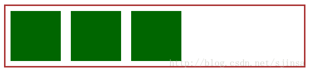

# 为什么产生浮动

## 什么是浮动

浮动是让文字像流水一样环绕文字，但是后续发现，让几个元素并排显示，加 float 会比较方便。

但是我们给这样的一个结构，用浮动来完成的时候，会发现



没有按照我们的期望方式，实际上他的父框架出现了“高度塌陷”


但是我们可以设置绿色方块的 display 属性为 inline-block，但是只能从左往右放置，有很大限制，所以我们必须要清除浮动。

## 清除浮动的两种方式

* 浮动元素底部放置空元素，插入 `clear:both;`
* 父元素 BFC（ie8+）或 haslayout(ie6/7)

### 方法一

如这样的一个布局

```javascript
<div class="box">
  <div class="div" />
  <div class="clear" />
</div>
```

```css
.box {
  width: 300px;
  margin: 0 auto;
  border: 10px solid #000000;
}

.div {
  width: 200px;
  height: 200px;
  background: red;
  float: left;
}

.clear {
  height: 0px;
  font-size: 0;
  clear: both;
  overflow: hidden;
}
```

这样可以解决这个问题，但是需要添加大量无意义的 DOM 结构，不符合语义化。

所以我们可以使用伪元素:after，具体是添加一个类 clearfix

```javascript
<div class="box clearfix">
  <div class="div" />
</div>
```

```css
.box {
  margin: 0 auto;
  border: 10px solid #000;
}

.div {
  width: 200px;
  height: 200px;
  background: red;
  float: left;
}

//IE6
.clearfix {
  *zomm: 1;
}

//IE8+
.clearfix:after {
  display: table;
  clear: both;
  content: "";
}
```

### 方法二的解决方案

使用 overflow 属性，给父元素添加 overflow:hidden ||auto

```css
overflow: hidden;
zoom: 1; //用于兼容IE6
```

### BFC-砌砖的解决方案

BFC 的特征

* 内部的 Box 会在垂直方向，从顶部开始一个接一个地放置。
* Box 垂直方向的距离由 margin 决定。属于同一个 BFC 的两个相邻 Box 的 margin 会发生叠加。
* 每个元素的 margin box 的左边， 与包含块 border box 的左边相接触(对于从左往右的格式化，否则相反)。即使存在浮动也是如此。
* BFC 的区域不会与 float box 叠加。
* BFC 就是页面上的一个隔离的独立容器，容器里面的子元素不会影响到外面的元素，反之亦然。
* 计算 BFC 的高度时，浮动元素也参与计算。

```css
/**
* 在标准浏览器下使用
* 1 content内容为空格用于修复opera下文档中出现
*   contenteditable属性时在清理浮动元素上下的空白
* 2 使用display使用table而不是block：可以防止容器和
*   子元素top-margin折叠,这样能使清理效果与BFC，IE6/7
*   zoom: 1;一致
**/

.clearfix:before,
.clearfix:after {
  content: " "; /* 1 */
  display: table; /* 2 */
}

.clearfix:after {
  clear: both;
}

/**
* IE 6/7下使用
* 通过触发hasLayout实现包含浮动
**/
.clearfix {
  *zoom: 1;
}
```
